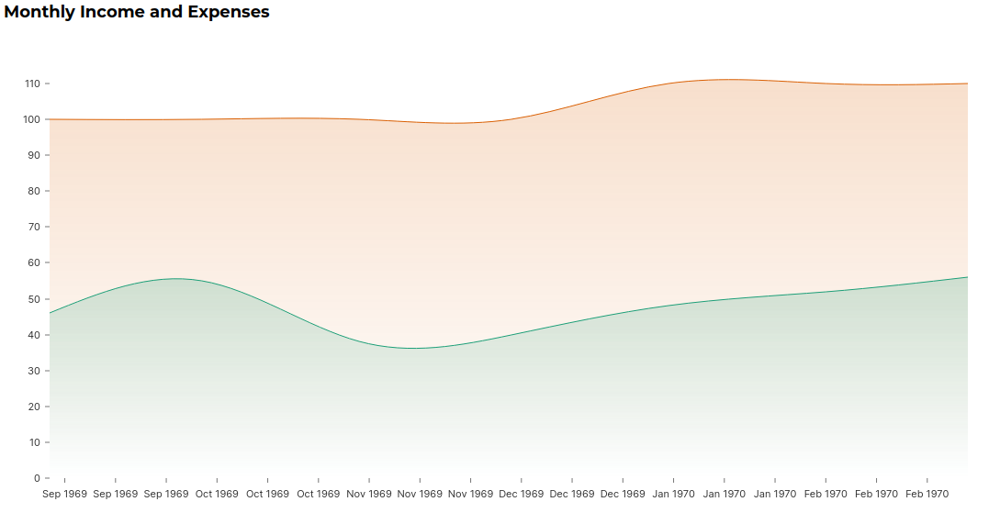
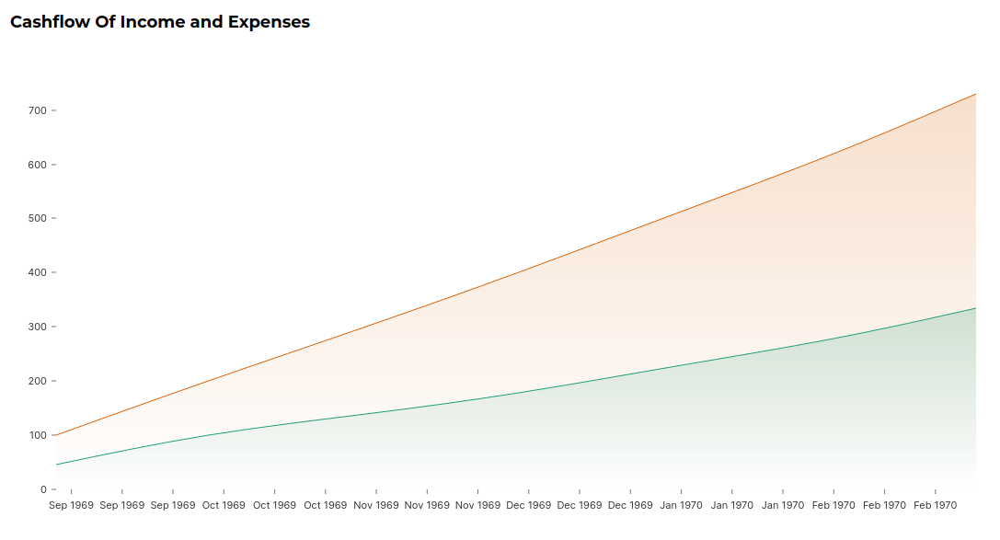
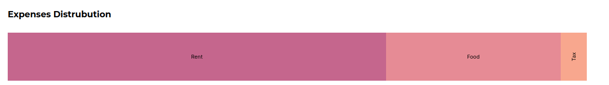
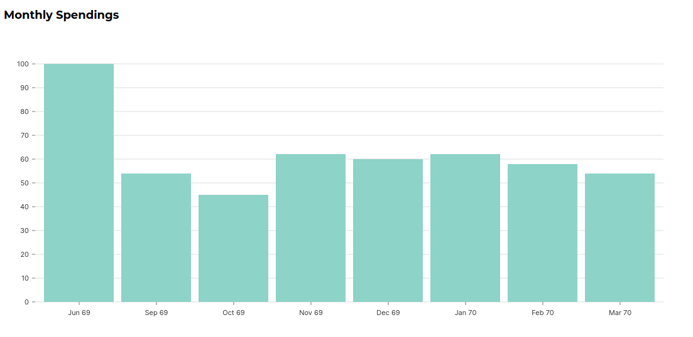

# Finances Visualizer 

Finance Visualizer for CLI Plain text, double entry accounting tool [ledger](https://www.ledger-cli.org/) compatible with [hledger](https://hledger.org)

- Frontend uses Nextjs
- Backend uses Rust with [axum](https://github.com/tokio-rs/axum) as http server

Example file used for visualization  can be found at ./example.ledger

Features

### Monthly Income vs Expenses charts
 

### Cashflow 

 

### Expense Distribution

 

### Monthly Expense 
 

### V2 Plans
- Stock Price visualization
